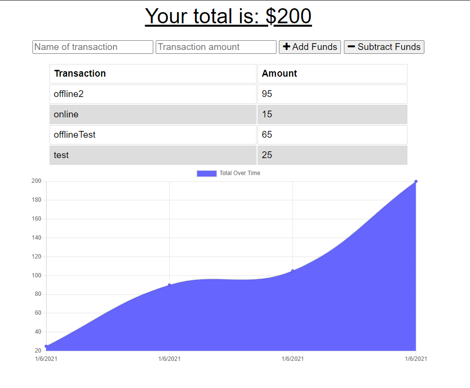

# Online/Offline Budget Trackers

 - ### GitHub Link: https://github.com/greysonkirk/OfflineBudget
 - ### Heroku Link: https://pure-plains-59071.herokuapp.com/


This is a Progressive Web App that allows users to budget while they're offline!
 
 Users can track their finances while they are either online or offline. 
 Every time they add or subract funds, their indexed DB will store the information and when they get back online, a bulk api post call will send it to the Mongo DB. 
 
The data below is the webmanifest for the PWA 
 ```json
{
    "name": "Budget Tracker App",
    "short_name": "Budget Tracker App",
    "icons": [{
            "src": "icons/icon-192x192.png",
            "sizes": "192x192",
            "type": "image/png"
        },
        {
            "src": "icons/icon-512x512.png",
            "sizes": "512x512",
            "type": "image/png"
        }
    ],

    "theme_color": "#ffffff",
    "background_color": "#ffffff",
    "start_url": "/",
    "display": "standalone"
}
```



 